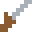
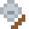
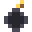
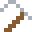

# Wand & Synergies

<!-- GENERATED by tools/gen-docs.js from the js/ source tables. Do not edit by hand. -->

In a run the mouse casts spells instead of painting. Spells cost mana
(which regenerates) and fire projectiles that paint elements on impact.
Cooldown and range are in sim frames (60 = one second).

## Spells

| | Spell | Mana | Cooldown | Damage | Effect |
| :---: | --- | ---: | ---: | ---: | --- |
|  | Spark Bolt | 10 | 12 | 10 | Fast bolt that splashes fire on impact — long range, reliable. |
|  | Water Jet | 2 | 2 | 2 | Three-shot spray of water; douses fire and fills basins. |
|  | Dig Blast | 4 | 9 | 6 | Excavates a pocket of terrain (never walls). Always in the loadout. |
|  | Powder Bomb | 28 | 50 | 18 | Lobbed charge with a devastating explosion. |
|  | Acid Spit | 9 | 12 | 9 | Splashes corrosive acid; melts terrain from safety. |
|  | Flamethrower | 3 | 2 | 4 | Short-range torrent — a fraction of spark's reach, ~5× the damage. |
|  | Arc Bolt | 14 | 18 | 8 | Electrifies water and open air into a lethal zone. |

### Evolutions

A spell **evolves** once your run holds two synergies carrying its
matching tag (Arc Bolt instead evolves through the Stormcore trophy).

| Spell | Tag ×2 | | Evolves into |
| --- | --- | :---: | --- |
| Spark Bolt | fire |  | Meteor Bolt |
| Water Jet | frost |  | Glacier Jet |
| Dig Blast | mobility |  | Tunnel Charge |
| Powder Bomb | blast |  | Powder Keg |
| Acid Spit | acid |  | Dissolver |
| Flamethrower | fire |  | Dragon's Breath |

## Synergies

Between levels you pick one of three synergies. Some are locked until a
milestone (best depth, wins, or kills) is reached.

| | Synergy | Effect | Unlock |
| :---: | --- | --- | --- |
|  | Pyromaniac | The world is far more flammable and burns longer. Fire only tickles you. | starter |
|  | Fireproof Hide | Fire barely hurts, lava is survivable, and you stop burning almost immediately. | starter |
|  | Frost Aura | The surface of water near you freezes into a walkable crust. The depths stay liquid. | starter |
|  | Lava Strider | Lava you approach crusts into stone, and what does touch you burns less. | 1 win |
|  | Steam Sprite | Steam heals you and lingers far longer. Boil a lake, breathe it in. | starter |
|  | Green Thumb | Plants spread through water aggressively, and trampling them heals you. | starter |
|  | Acid Blood | Taking damage makes you leak acid, and acid corrodes you far less. | 15 kills |
|  | Demolitionist | Explosions are much bigger. Gunpowder is your friend. Probably. | reach depth 4 |
|  | Fleetfoot | Move faster and jump higher. | starter |
|  | Powder Bomb | Your wand learns Powder Bomb: a lobbed charge with a devastating blast. | reach depth 3 |
|  | Acid Spit | Your wand learns Acid Spit: melt terrain from a safe distance. | starter |
|  | Flamethrower | Your wand learns Flamethrower: point blank, everything burns. Including, possibly, you. | 10 kills |
|  | Arc Bolt | Your wand learns Arc Bolt: electricity that turns pools into kill zones. | starter |
|  | Overcharge | Mana regenerates 80% faster. Cast with abandon. | starter |
|  | Wand: Twin Cast | Every cast fires an extra projectile, at a slight cooldown cost. | reach depth 2 |
|  | Wand: Rapid Fire | Your wand cools down 45% faster. | starter |
|  | Wand: Amplifier | Projectiles hit 50% harder and burst with a bigger splash. | starter |
|  | Wand: Bouncing Shots | Projectiles ricochet off terrain one more time before bursting. | 25 kills |
|  | Storm Caller | The storm never ends — and its lightning never strikes near you. | reach depth 5 |
|  | Insulated | Electricity barely tickles you. Live water is your wading pool. | starter |
|  | Executioner | Vulnerability windows last half again as long. Make them count. | fell 5 elites |
|  | Wormheart | The worm's furnace beats in your chest: burning no longer harms you — it keeps you warm. | slay the Magma Worm |
|  | Stormcore | You took its weapon: Arc Bolt impacts call down a real lightning strike. | slay the Tempest |
|  | Heartseed | The grove accepts you: foliage parts for you instead of slowing you, and trampling it heals. | slay the Overgrowth |
|  | Iron Boots | Landing on any enemy crushes it, armor and all — then you bounce clear. | starter |
|  | Winter Pelt | Hypothermia cannot touch you. Heat, though, bites much harder. | starter |
|  | Furnace Heart | Heatstroke cannot touch you. The cold, though, bites much harder. | starter |
|  | Ember Heart | You radiate furnace heat: never cold, ice and snow melt around you — but water simmers away near you. | 20 kills |
|  | Tunneler | Stone, sand, and ice near you slowly crumble away. You are the shovel. | starter |
